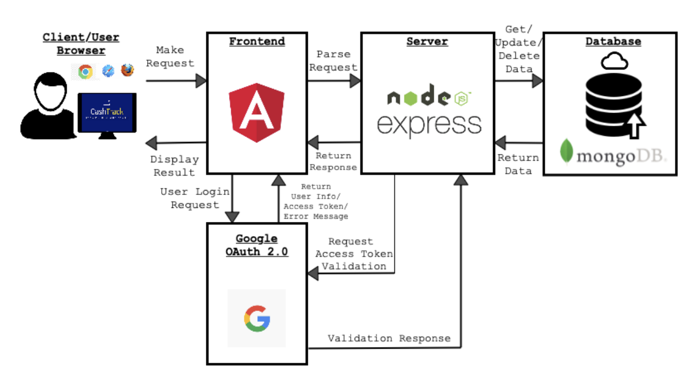

# CashTrack

> CZ3002 Advanced Software Engineering \
> School of Computer Science and Engineering \
> Nanyang Technological University


CashTrack provides an integrated platform solution that enables users to collectively record, analyse and settle their monetary transactions between each other. The key features of this expense tracker application are as follows:

**1. Personal Expense Tracking**

Allows tracking of an individual’s expenditure, in terms of how much they owe and are owed by other people, as well as their own expenditure such as food, travel, etc. Supplementary features offered include record categorisation, currency conversion, and data analytics to support management of the expenses under the user set spending limit.


**2. Shared Group Expense Tracking**

Allows splitting bills and tracking payment statuses while actively monitoring & notifying the parties involved. Users adding the shared expense record may specify the record category, use the automatic split by ratio/percentage/shares option, or add comments to the shared expense record.


 
**3. Data Analytics**

Presents a comprehensive analysis of users’ expense data over time or by categories. This aims to reveal insightful user spending patterns and effectively visualise transaction histories for both personal and shared expenses via the following:
- Pie Chart (Personal Expenses): Shows user spending categories (Food, Travel, Shopping, Entertainment, Others) by percentages, based on the user's personal expense records
- Line Chart (Shared Expenses): Shows the quantitative spending trend of the user with respect to their set personal expense limit
- Line Chart (Shared Expenses): Shows the transactory relationship between the user and their friend, by showcasing the magnitude of inflow or outflow of funds for their shared expenses over a specified time frame. 

<p align="center"></p>

**4. Chat**

An integrated chat feature to facilitate inter-user communication for expense discussions and increased engagement with the application platform.

### System Architecture
CashTrack conforms to the Model-View-Control (MVC) architectural pattern to achieve low coupling and high cohesion between various software components.

<p align="center"></p>

### Documentation
For further information, the following resources may be accessed [here](https://github.com/anushadatta/CashTrack/tree/master/documentation):
- Architecture Specification
- API Documentation
- Demo Video Clips 
- Lab Deliverables 

### SET UP: Deployment

<b> Backend </b>
```
~$ cd back-end
~$ npm i // for first time
~$ npm start 
~$ npm run start-dev // for auto real time refresh, uses nodemon
````

<b> Frontend </b>
````
~$ cd front-end
~$ npm install // for first time
~$ ng  build
~$ ng serve
~$ ng build // for release
````

### Team
* Anusha Datta
* Amrita Ravishankar
* Mehul Kumar 
* Daniel Loe
* Nicklaus Tan
* Alex Leong
* Elliott Ong
* S Sri Kalki
